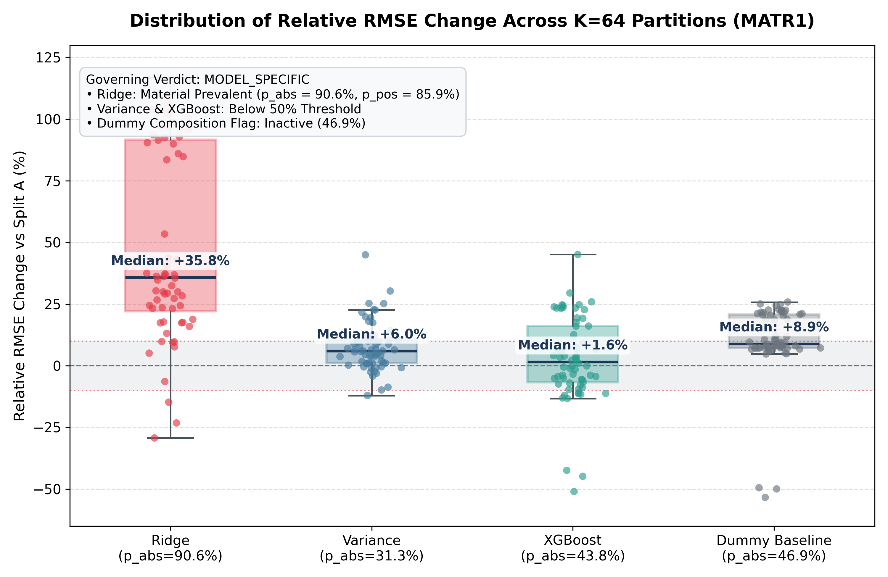
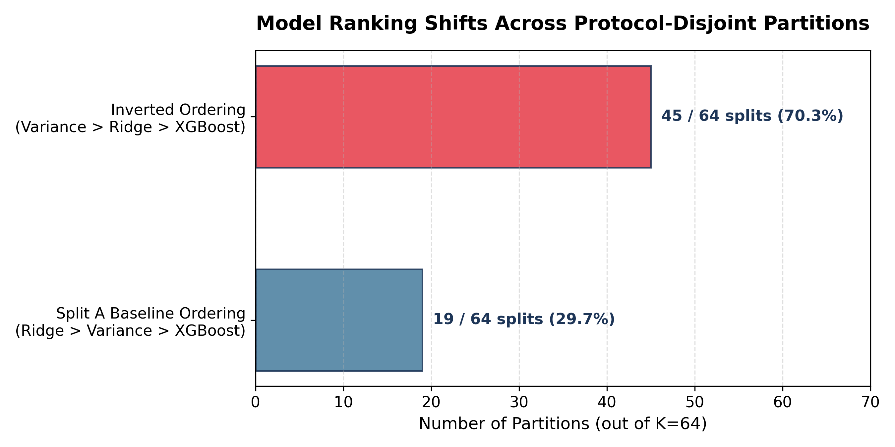
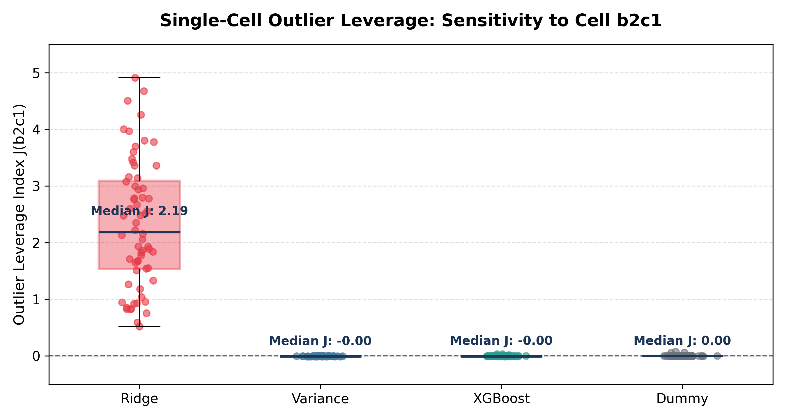

# BatteryML Protocol Robustness — S3 Multi-Split Sweep

> **Preregistered Robustness Study on BatteryML MATR1 Benchmark**  
> **Governing Verdict:** `MODEL_SPECIFIC` (Ratified by Operator [L3])  
> **Status:** `RATIFIED / CLOSED` | **Scope:** 64 protocol-disjoint partitions · 264 model fits

---

## Study Design & Scope

- **Sampling scope:** The minimum-cost protocol-disjoint space contains 185,471 partitions. The preregistered S2.1 reference partition was excluded from S3 random sampling, leaving 185,470 eligible partitions; $K=64$ was sampled uniformly without replacement from that population.
- **Non-blind design:** S2.1 results were known before the S3 preregistration was frozen; this exposure was explicitly preregistered.

---

## Empirical Results & Distributional Maps

### 1. Relative RMSE Shift Distribution across 64 Partitions


### 2. Benchmark Ordering Shifts


### 3. Outlier Cell Leverage Index $J(b2c1)$


---

## Adjudication Summary

| Model | Baseline RMSE (Split A) | Median $\Delta\text{RMSE}$ | IQR $\Delta\text{RMSE}$ | $p_{\text{abs}}$ ($\ge 10\%$) | $p_{\text{pos}}$ ($\ge +10\%$) | Material Prevalent |
| :--- | :---: | :---: | :---: | :---: | :---: | :---: |
| **Ridge** | 115.8 | **+35.8%** | +22.1% to +91.7% | **90.6%** (58/64) | **85.9%** (55/64) | **Yes** |
| **Variance** | 136.1 | **+6.0%** | +1.1% to +10.6% | 31.3% (20/64) | 29.7% (19/64) | No |
| **XGBoost** | 333.7 | **+1.6%** | -6.7% to +16.1% | 43.8% (28/64) | 28.1% (18/64) | No |
| *Dummy* | 398.8 | *+8.9%* | +7.3% to +20.7% | *46.9%* (30/64) | *42.2%* (27/64) | Flag Inactive (<50%) |

- **Benchmark Ordering Change:** 45 of 64 partitions (70.3%) inverted from Split A baseline (`Variance > Ridge > XGBoost`).
- **Governing Verdict Rule:** Exactly one model (Ridge) crossed the preregistered $\ge 50\%$ material-prevalence threshold $\rightarrow$ `MODEL_SPECIFIC`.
- **Composition Diagnostic:** Dummy composition flag did not activate ($p_{\text{abs}} = 46.9\% < 50\%$), but dummy RMSE shifted by median $+8.9\%$, so composition effects are not ruled out.

---

## Core Artifacts & Proof Receipts

| Artifact | Purpose | Hash / Status |
| :--- | :--- | :--- |
| [`PREREGISTRATION.md`](PREREGISTRATION.md) | Frozen S3 design & statistical decision rules | `0958e89...` |
| [`receipts/verdict-ratification-receipt.txt`](receipts/verdict-ratification-receipt.txt) | Operator [L3] Verdict Ratification Receipt | `RATIFIED / CLOSED` |
| [`receipts/governing-adjudication.json`](receipts/governing-adjudication.json) | Full Ratified Adjudication Record | `36df005f...` |
| [`receipts/post-run-binding-receipt.json`](receipts/post-run-binding-receipt.json) | Execution identity & dataset binding | `1ad8fdc4...` |
| [`s3-split-manifest.csv`](s3-split-manifest.csv) | Full 64-split partition manifest | `cf9c269a...` |
| [`WALKTHROUGH.md`](WALKTHROUGH.md) | Audit trail & step-by-step reproduction log | Complete |
| [`STATUS.md`](STATUS.md) | State ledger & state transitions | Complete |

---

## Independent Verification

```bash
# 1. Verify exact unranking & DP counts (185,471 partitions):
python3 s3_sampler.py --sampler-input sampler_input.csv

# 2. Run unit tests & synthetic adjudication fuzzing:
python3 -m unittest discover -s tests -p "test_*.py"

# 3. Verify complete recomputation of all 264 fits & metrics from per-cell predictions:
python3 verifiers/verify_s3_recomputation.py
```

*Code: MIT · Data: CC BY 4.0 · Instance: `batteryml-protocol-robustness-s3`*
